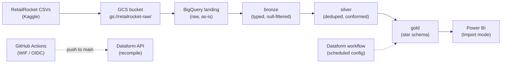

# RetailRocket: A BigQuery Data Warehouse for Real-World e-commerce business data.

An end-to-end, fully serverless data warehouse on **Google Cloud**, built from a public
real-world e-commerce clickstream dataset. Raw CSVs first land in Cloud Storage, then it passes through a
**medallion architecture** (landing → bronze → silver → gold) orchestrated by
**Dataform**, and surface as a **Kimball star schema** in BigQuery which can be easily connected to a BI layer.

| | |
|---|---|
| **Cloud** | Google Cloud — BigQuery, Cloud Storage, IAM, Workload Identity Federation |
| **Transformation** | Dataform (SQLX models, dependency graph, assertions) |
| **CI/CD** | GitHub Actions — keyless (OIDC) authentication, auto-recompile on push |
| **BI** | Power BI (Import mode via the native BigQuery connector) |
| **Dataset** | [RetailRocket](https://www.kaggle.com/retailrocket/retailrocket-ecommerce-dataset) — e-commerce events, May–Sep 2015 |
| **Scale** | ~23M rows / ~900 MB raw (2.76M events, 20.3M item-property rows, 1,669 categories) |
| **Cost** | $0 as it runs entirely within the BigQuery free tier (1 TiB queries + 10 GiB storage / month) |

## Why this project

This project serves as a challenge to build an end-to-end data engineering & analytics platform for BI analytics on a modern cloud platform. Instead of just creating a dashboard, this project starts with the engineering of a data warehouse layer to serve a reusable, secure, reproducible, resilient and modern data pipeline for the business intelligence inside of the dashboard downstream. The warehouse uses a star-schema design which was first implemented on
Microsoft Azure (Blob → Databricks PySpark → Azure SQL), but the **Azure for Students
subscription expired**, cutting off access to every Azure service. Since the pipeline
could no longer be managed, the data engineering foundation was migrated to use BigQuery and Dataform.

The design was migrated to Google Cloud, where BigQuery is **fully serverless**:
On Azure, managing a cluster proved difficult due to a limited subscription. However, The star schema, grain, and cleansing rules were carried over
unchanged; only the platform-specific code was rewritten (PySpark → Dataform SQLX,
ADF → Dataform workflows, service-account keys → Workload Identity Federation).

## Architecture



| Layer | Dataset | What it does | Built by |
|---|---|---|---|
| Landing | `retailrocket_landing` | Raw CSVs loaded as-is, schema auto-detected | `bq load` from GCS |
| Bronze | `retailrocket_bronze` | Types enforced (epoch-ms → `TIMESTAMP`), null keys removed | Dataform SQLX |
| Silver | `retailrocket_silver` | Deduplicated on business keys; `item_properties` filtered to `categoryid` / `available` | Dataform SQLX |
| Gold | `retailrocket_gold` | Star schema: 5 dimensions + 1 fact table | Dataform SQLX |
| Quality | `retailrocket_dataform_assertions` | Data-quality checks as assertion views | Dataform assertions |

## Dataform models and what they do

Every transformation is a `.sqlx` file (SQL + a `config` block) under `dataform/definitions/`.
Dataform resolves the `${ref("...")}` dependencies automatically and runs the layers in order.
19 files total: 3 declarations, 9 transformation models, 6 gold models, 4 assertions
(the quality folder overlaps — see below).

### Sources (3): declare what already exists in BigQuery

These don't build anything; they register the landing tables so `${ref()}` can point at them.

| File | Declares | Notes |
|---|---|---|
| `sources/raw_events.sqlx` | `retailrocket_landing.events` | 2.76M rows |
| `sources/raw_category_tree.sqlx` | `retailrocket_landing."category tree"` | Note the space in the physical table name — the declaration must match it exactly |
| `sources/raw_item_properties.sqlx` | `retailrocket_landing."item properties"` | 20.3M rows, also has a space |

> One `config` block per file, initial versions of the pipeline revealed that Dataform's compiler silently drops all but one if you stack them into a single file.

### Bronze (3): typing and hard filtering

The bronze layer cast types and drops null rows.

| File | Output table | What it does |
|---|---|---|
| `bronze/events.sqlx` | `retailrocket_bronze.bronze_events` | Casts all columns to explicit types; converts the 13-digit epoch-ms `timestamp` into a real `TIMESTAMP` (`TIMESTAMP_MILLIS`) + keeps `timestamp_ms`; **drops rows with null `visitorid` or `itemid`** (unattributable events); inline `nonNull` assertions |
| `bronze/category_tree.sqlx` | `retailrocket_bronze.bronze_category_tree` | Pass-through (`SELECT *`) — the file is a typed placeholder so the layer graph is complete |
| `bronze/item_properties.sqlx` | `retailrocket_bronze.bronze_item_properties` | Casts `timestamp` to `INT64` (`timestamp_ms`); keeps `value` as STRING (it holds both category IDs and availability flags) |

### Silver (3): cleansing and conformance

Silver removes duplicates and narrows the property change-log to what the model actually uses.

| File | Output table | What it does |
|---|---|---|
| `silver/events.sqlx` | `retailrocket_silver.silver_events` | **Dedupes** on `(timestamp_ms, visitorid, itemid, event)` using `QUALIFY ROW_NUMBER() ... = 1` (orders by `transactionid DESC` so the row carrying a transaction survives); filters null timestamps; inline `nonNull` assertions |
| `silver/category_tree.sqlx` | `retailrocket_silver.silver_category_tree` | Pass-through from bronze |
| `silver/item_properties.sqlx` | `retailrocket_silver.silver_item_properties` | **Filters the property change-log to `categoryid` and `available` only** (the other ~dozens of properties are unused); dedupes on `(itemid, property, timestamp_ms)` |

### Gold (6): the star schema

| File | Output table | What it does |
|---|---|---|
| `gold/dim_date.sqlx` | `retailrocket_gold.dim_date` | Calendar dimension built from **distinct event dates** in silver (138 days, May–Sep 2015). `full_date` (DATE) is the PK — Kimball's natural-key exception. Adds `year`, `month`, `day`, `day_of_week`, `day_name`, `is_weekend`, `month_name`, `quarter` |
| `gold/dim_users.sqlx` | `retailrocket_gold.dim_users` | One row per visitor. `user_sk = FARM_FINGERPRINT(visitorid)`; aggregates first/last event timestamps, `total_events`, `total_purchases`, and a `has_purchased` flag |
| `gold/dim_items.sqlx` | `retailrocket_gold.dim_items` | One row per item **seen in events** (not the full catalog). Pulls the **latest** `categoryid` and `available` flag per item from the silver change-log (`QUALIFY ROW_NUMBER() ... ORDER BY timestamp_ms DESC`), COALESCEs missing availability to 0, joins the category SK. This is **SCD Type 1** (latest state wins, no history) |
| `gold/dim_categories.sqlx` | `retailrocket_gold.dim_categories` | Category dimension with the `parent_id` hierarchy from the category tree; `category_sk = FARM_FINGERPRINT(categoryid)` |
| `gold/dim_event_type.sqlx` | `retailrocket_gold.dim_event_type` | Tiny conformed dimension: the 3 distinct event types (`view`, `addtocart`, `transaction`) with hashed SKs |
| `gold/fact_events.sqlx` | `retailrocket_gold.fact_events` | **The fact table — one row per user action.** `event_sk` = fingerprint of `(visitorid, timestamp_ms, itemid, event)`; `event_date` = `DATE(event_timestamp)`; **INNER JOINs** all four dimensions (date, user, item, event type). Declares `PARTITION BY event_date` + `CLUSTER BY user_sk, item_sk` in the `bigquery` config block, plus `nonNull` assertions on all keys |

> **Why INNER JOIN:** every dimension derives from `silver_events`, so matches are guaranteed.
> If one ever isn't, the `row_counts` assertion fails loudly and the bug is surfaced for analysts to see instead of
> filling with NULLs while keeping row_count identical to the source of truth, which makes failures harder to detect.

### Quality (4): custom assertions

Each compiles into a **view** in `retailrocket_dataform_assertions` that returns rows only
when something is wrong (empty result = pass). This serve as a validation and verification check which is executed by Dataform workflows after the rest of the pipeline. 

| File | Check |
|---|---|
| `quality/row_counts.sqlx` | `COUNT(fact_events)` must equal `COUNT(silver_events)` — proves the 1:1 grain survived the fact build |
| `quality/unique_keys.sqlx` | `COUNT(*) = COUNT(DISTINCT pk)` for all 6 gold tables — catches duplicate surrogate/date keys |
| `quality/referential_integrity.sqlx` | LEFT JOINs the fact table against all 4 dimensions and fails if any FK is orphaned |
| `quality/business_logic.sqlx` | Domain rules in one UNION ALL view: exactly 3 event types, correct type set, no future dates, date starts in 2015, day-of-week/quarter in range, no negative item IDs, no `transactionid` on non-transaction events |

In addition to these 4 custom files, **built-in assertions** (`uniqueKey`, `nonNull`) are
declared inline in each model's `config` block — those compile into auto-named views in the
default assertion dataset.

## Data model (gold)

```
                    dim_date (full_date PK)
                          ▲
dim_users ──┐             │
            ├─▶ fact_events (one row per user action)
dim_items ──┤      PARTITION BY event_date
            │      CLUSTER BY user_sk, item_sk
dim_event_type ┘
dim_items ──▶ dim_categories (parent-child hierarchy)
```

- **Grain:** one row per user event (view / addtocart / transaction)
- **Surrogate keys:** `FARM_FINGERPRINT(natural_key)` — deterministic, so re-runs are
  idempotent (no `AUTO_INCREMENT` in BigQuery; and `FARM_FINGERPRINT` is signed, so
  negative keys are expected by design)
- **`dim_date` uses its natural key (`DATE`) as the PK** — Kimball's accepted exception
  to the surrogate-key rule, eliminating a redundant column from the fact table and
  enabling native DATE partitioning
- **Performance:** `fact_events` is partitioned by `event_date` and clustered by
  `user_sk, item_sk` to keep BI queries cheap

## Data quality

Dataform runs assertions automatically after each execution:

| Assertion | Checks |
|---|---|
| `row_counts` | Fact rows = silver events (1:1 grain preserved) |
| `unique_keys` | Primary keys unique across all 6 gold tables |
| `referential_integrity` | No orphan foreign keys in `fact_events` |
| `business_logic` | Event-type set, valid date ranges, transaction-ID rules |

Plus built-in `nonNull` / `uniqueKey` constraints declared inline on every model.

## CI/CD — keyless authentication

Pushes to `main` trigger a GitHub Actions workflow that recompiles the Dataform
release configuration and promotes it to production — using **Workload Identity
Federation (OIDC)**:

- **No stored credentials.** No service-account JSON in GitHub secrets, no PATs.
  Each run authenticates with a short-lived OIDC token that expires with the job.
- **Dev/prod separation:** the `dev` workspace writes to `*_dev` schemas; the
  `main`-branch release configuration writes to production schemas.
- The workflow calls the Dataform API directly (create compilation result → update
  release config), because release configurations don't recompile automatically on
  Git push.

## Repository layout

```
├── .github/workflows/       # Dataform recompile on push (WIF/OIDC)
├── bronze/                  # Ingestion scripts + row-count verification (audit record)
├── dataform/                # Dataform workspace mirror (connected to this repo)
│   └── definitions/
│       ├── sources/         # Landing-layer declarations
│       ├── bronze/          # Typed models
│       ├── silver/          # Deduplicated / conformed models
│       ├── gold/            # Star schema models
│       └── quality/         # Custom data-quality assertions
├── warehouse/schema/        # Exported BigQuery DDL (documentation)
└── workflow_settings.yaml   # Dataform project defaults
```

## Verified data integrity

Landing-layer loads were validated against the Kaggle-documented row counts:

| Table | Rows loaded | Kaggle expected | Result |
|---|---:|---:|:---:|
| `events` | 2,756,101 | 2,756,101 | ✅ |
| `category_tree` | 1,669 | 1,669 | ✅ |
| `item_properties` | 20,275,902 | 20,275,902 | ✅ |

Header-row handling was confirmed using two ways: exact row-count match, and `INTEGER`
column types (a stray header row would have forced `STRING`).

## Downstream analytics

The gold layer feeds a Power BI model via the native BigQuery connector in
**Import mode** which was chosen deliberately: the dataset is a fixed historical snapshot,
and importing once protects the BigQuery query free tier. A **conversion-funnel
dashboard implementation is currently in the works** (funnel: views → add-to-cart
→ transactions, built on `fact_events` + `dim_event_type`), with customer
segmentation and category/availability analysis planned next.
