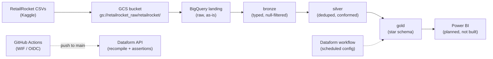

# RetailRocket: A BigQuery Data Warehouse for Real-World e-commerce business data.

An end-to-end, fully serverless data warehouse on **Google Cloud**, built from a public
real-world e-commerce clickstream dataset. Raw CSVs first land in Cloud Storage, then it passes through a
**medallion architecture** (landing → bronze → silver → gold) orchestrated by
**Dataform**, and surface as a **Kimball star schema** in BigQuery which can be easily connected to a BI layer.

| | |
|---|---|
| **Cloud** | Google Cloud — BigQuery, Cloud Storage, IAM, Workload Identity Federation |
| **Transformation** | Dataform (SQLX models, dependency graph, assertions) |
| **CI/CD** | GitHub Actions — keyless (OIDC) authentication, auto-recompile on push |
| **BI** | Power BI (Import mode via the native BigQuery connector) |
| **Dataset** | [RetailRocket](https://www.kaggle.com/retailrocket/retailrocket-ecommerce-dataset) — e-commerce events, May–Sep 2015 |
| **Scale** | ~23M rows / ~900 MB raw (2.76M events, 20.3M item-property rows, 1,669 categories) |
| **Cost** | $0 as it runs entirely within the BigQuery free tier (1 TiB queries + 10 GiB storage / month) |

## The dataset

[RetailRocket](https://www.kaggle.com/datasets/retailrocket/ecommerce-dataset) is an anonymized clickstream log from a real-world e-commerce website, published by Retail Rocket (retailrocket.io), a real-time product-recommendation platform, for one stated purpose: "to motivate researchers in the field of recommender systems with implicit feedback." In plain terms: it records what visitors actually did on a shop, which pages they viewed, what they added to cart, what they bought, rather than what the shop sold. It is raw signal from one shop, not a sales ledger.

The log is raw, with all values hashed for confidentiality. Only two properties survive readable: `categoryid` and `available`. Everything else (prices, text, brands) is hashed, so no price or product-name analysis is possible. That is the publisher's design, not a limitation of this pipeline.

| File | Rows | Size | What it holds |
|---|---|---|---|
| `events.csv` | 2,756,101 | 94 MB | One row per visitor action |
| `item_properties_part1+2.csv` | 20,275,902 | 893 MB | Change log of item attributes over time (originally weekly snapshots, over 200M rows; the publisher merged consecutive constant values, cutting it roughly 10 times) |
| `category_tree.csv` | 1,669 | 14 KB | Category hierarchy in child to parent form (empty parent = root) |

Three files, 987.5 MB total (Kaggle version 2).

### Columns

| Column | Found in | Meaning | Odd about it |
|---|---|---|---|
| `timestamp` | events, item_properties | When the action or property change happened | Unix milliseconds (13 digits), not seconds. Divide by 1000 before converting |
| `visitorid` | events | The visiting user, as a pseudonymous ID | No session ID anywhere, so visits cannot be split into separate browsing sessions |
| `event` | events | What the visitor did | Three values: `view` (2,664,312), `addtocart` (69,332), `transaction` (22,457). The dataset spells addtocart as one word |
| `itemid` | events, item_properties | The product | 417,053 distinct items exist in the properties file; 235,061 appear in events |
| `transactionid` | events | The purchase reference | Filled only on `transaction` rows. All 22,457 non-null values sit on transactions, zero violations |
| `property` | item_properties | Which attribute changed | 1,104 distinct keys, but only `categoryid` and `available` are readable; the rest are hashed |
| `value` | item_properties | The attribute value | Mostly hashed numbers. Readable only for category IDs and the 0/1 availability flag |
| `categoryid` | category_tree | A category in the hierarchy | The only analytic key in the properties file |
| `parentid` | category_tree | The parent category | Empty means root level |

**Coverage and license.** May 3 to September 18, 2015 (4.5 months), 139 calendar dates with activity, 1,407,580 unique visitors, 417,053 unique items in the properties file. License is [CC BY-NC-SA 4.0](https://creativecommons.org/licenses/by-nc-sa/4.0/), stated on the Kaggle dataset page. The publisher's own caveat: their dataset tasks note that browsing logs can contain "up to 40% abnormal traffic", which is exactly why this pipeline profiles the heavy-visitor tail before any per-user analysis.

**What this data cannot tell you:** no prices or product names (hashed), no sessions (no session ID), one shop only, one 4.5-month window in 2015, and no returns or cancellations, so a `transaction` row is treated as a completed purchase.

## Why this project

This project serves as a challenge to build an end-to-end data engineering & analytics platform for BI analytics on a modern cloud platform. Instead of just creating a dashboard, this project starts with the engineering of a data warehouse layer to serve a reusable, secure, reproducible, resilient and modern data pipeline for the business intelligence inside of the dashboard downstream. The warehouse uses a star-schema design which was first implemented on
Microsoft Azure (Blob → Databricks PySpark → Azure SQL), but the **Azure for Students
subscription expired**, cutting off access to every Azure service. Since the pipeline
could no longer be managed, the data engineering foundation was migrated to use BigQuery and Dataform.

The design was migrated to Google Cloud, where BigQuery is **fully serverless**:
On Azure, managing a cluster proved difficult due to a limited subscription. However, The star schema, grain, and cleansing rules were carried over
unchanged; only the platform-specific code was rewritten (PySpark → Dataform SQLX,
ADF → Dataform workflows, service-account keys → Workload Identity Federation).

## Architecture



The three Kaggle CSVs are uploaded once to a Cloud Storage bucket (`gs://retailrocket_raw/retailrocket/`, note the underscores). Through the Google Cloud Console, the raw files are then ingested into the landing dataset in BigQuery. From there Dataform takes over: during development, each push happens to 'dev', which then is PRd to `main` after completion of the entire medallion layer, it thens trigger GitHub Actions; the workflow authenticates without any stored key and asks the Dataform API to recompile and run every model and assertion. The layers build in order, landing to bronze to silver to gold, and a failed assertion stops the build. Everything in solid lines is built and running today. The Power BI node is planned; it does not exist yet.

## Tech stack and it's role in the project

| Tool | What it does here |
|---|---|
| Google Cloud Storage | Holds the raw CSVs as the initial landing zone. |
| BigQuery | The warehouse itself. Stores every layer and serves queries. Serverless, which is the reason the project could survive losing the Azure subscription |
| Dataform | Writes and orchestrates all transformations as SQLX files with a dependency graph. Replaces the Azure notebooks and Azure Data Factory from the predecessor project (PySpark became Dataform SQLX, ADF became Dataform workflows) |
| Dataform assertions | The four quality checks that run after every build. Replaces the manual verification notebook of the Azure build |
| GitHub Actions with Workload Identity Federation (OIDC) | Recompiles and runs Dataform on every push to `main`. Uses short-lived tokens instead of service-account keys, so no secret exists in the repository. Replaces the PAT-based workflow of the Azure build |
| `workflow_settings.yaml` | Dataform project defaults: project ID, target datasets, core version |
| Power BI (planned) | Would consume the gold tables through the native BigQuery connector in Import mode, acts as the BI layer for funnel conversion analytics. Not built yet |

## Layers in the ETL pipeline

| Layer | Dataset | What it does | Built by |
|---|---|---|---|
| Landing | `retailrocket_landing` | Raw CSVs loaded as-is, schema auto-detected | `bq load` from GCS |
| Bronze | `retailrocket_bronze` | Types enforced (epoch-ms → `TIMESTAMP`), null keys removed | Dataform SQLX |
| Silver | `retailrocket_silver` | Deduplicated on business keys; `item_properties` filtered to `categoryid` / `available` | Dataform SQLX |
| Gold | `retailrocket_gold` | Star schema: 5 dimensions + 1 fact table | Dataform SQLX |
| Quality | `retailrocket_dataform_assertions` | Data-quality checks as assertion views | Dataform assertions |

## Dataform models and what they do

Every transformation is a `.sqlx` file (SQL + a `config` block) under `dataform/definitions/`.
Dataform resolves the `${ref("...")}` dependencies automatically and runs the layers in order.
19 files total: 3 declarations, 9 transformation models, 6 gold models, 4 assertions
(the quality folder overlaps — see below).

## Cleaning and transformation steps

Every count below was recomputed on the full Kaggle CSVs (987.5 MB) with the same rules the SQL applies, then cross-checked against the production tables. Counts are measured, not estimated.

### Landing to Bronze: Cast and Basic Null Filtering

| Step | What it does | Why it matters | Rows before | Rows after | Where in the code |
|---|---|---|---|---|---|
| Load CSVs with autodetected schema, header skipped | Puts the raw files into `retailrocket_landing` as-is | The byte-level starting point every later count is measured from | 2,756,101 events | 2,756,101 events | `bronze/load_landing.sh`, verified by `bronze/verify_counts.sql` |
| Cast `timestamp` to INT64, derive `event_timestamp` with `TIMESTAMP_MILLIS` | Converts 13-digit Unix milliseconds to a real timestamp | CSV autodetect can land the value as STRING or FLOAT, which silently corrupts later date logic. Millis, not seconds, is the source unit | 2,756,101 | 2,756,101 | `definitions/bronze/events.sqlx` |
| Cast `visitorid`, `itemid`, `transactionid` to INT64 | IDs stop comparing as strings | String IDs break joins and sort order | 2,756,101 | 2,756,101 | `definitions/bronze/events.sqlx` |
| Filter null `visitorid` or `itemid`, with inline `nonNull` assertions | Rows without both keys cannot join any dimension, so they are removed early and loudly | **Verified effect: 0 rows removed.** The raw file has no null keys, so the guard costs nothing and documents intent | 2,756,101 | 2,756,101 | `definitions/bronze/events.sqlx` |
| `category_tree`: exact pass-through | Already clean at source | Transforming it would add risk, not value | 1,669 | 1,669 | `definitions/bronze/category_tree.sqlx` |
| `item_properties`: cast `timestamp` to INT64 only | Keeps the full change log intact at bronze for audit fidelity | Filtering is an analytic decision, and that belongs one layer later | 20,275,902 | 20,275,902 | `definitions/bronze/item_properties.sqlx` |

### Bronze to Silver: one row = one real event

| Step | What it does | Why it matters | Rows before | Rows after | Where in the code |
|---|---|---|---|---|---|
| Filter null `timestamp_ms` | An event without a time cannot be placed on the date dimension | A time-series warehouse cannot use an undated event | 2,756,101 | 2,756,101 (no null times in source) | `definitions/silver/events.sqlx` |
| Dedup on `(timestamp_ms, visitorid, itemid, event)` with `QUALIFY ROW_NUMBER() ... = 1`, ordered by `transactionid DESC` | The natural identity of an event is (when, who, what item, what action); a repeat of that tuple is a logging artifact | **Verified: removes 460 rows (0.017%).** The `transactionid DESC` tie-break keeps the row that carries a transaction ID over a null duplicate, which is why all 22,457 transactions survive dedup intact | 2,756,101 | 2,755,641 | `definitions/silver/events.sqlx` |
| Keep only `property IN ('categoryid', 'available')` in `item_properties`, then dedup on `(itemid, property, timestamp_ms)` | Of the change log, everything except these two keys is hashed and unreadable | Keeps only what can be read: **2,291,853 rows (11.3%)** of 20,275,902. A 20M-row wall becomes a joinable attribute source | 20,275,902 | 2,291,853 | `definitions/silver/item_properties.sqlx` |
| `category_tree`: pass-through from bronze | Already clean | Same decision as bronze, restated at this layer | 1,669 | 1,669 | `definitions/silver/category_tree.sqlx` |
| Inline `nonNull` assertions on `visitorid`, `itemid`, `timestamp_ms`, `event` | Guards the grain definition itself | A NULL in any of the four dedup keys means the dedup key is broken, so the model refuses to build | 2,755,641 | 2,755,641 | `definitions/silver/events.sqlx` |

### Silver to Gold: star schema

| Step | What it does | Why it matters | Rows before | Rows after | Where in the code |
|---|---|---|---|---|---|
| `dim_date`: `DISTINCT DATE(event_timestamp)` plus calendar attributes | Calendar spinebuilt from the data | Covers exactly the **139 dates** with activity, no empty dates to filter in every chart. Derived attributes pre-computed so BI never re-derives them per query | 2,755,641 events | 139 dates | `definitions/gold/dim_date.sqlx` |
| `dim_users`: `GROUP BY visitorid` with first/last event, totals, `has_purchased` | Rolls session-level noise into an analyzable user grain | One row per visitor, ready for repeat-purchase segmentation | 2,755,641 events | 1,407,580 users | `definitions/gold/dim_users.sqlx` |
| Every surrogate key from `FARM_FINGERPRINT(...)` (`user_sk`, `item_sk`, `category_sk`, `event_type_sk`, `event_sk`) | The same natural key always hashes to the same ID | Deterministic, so re-running a model is idempotent and facts re-join correctly after every build. The Azure predecessor used `monotonically_increasing_id()`, which regenerates keys on every Spark evaluation and silently breaks referential integrity; this migration removes that failure class entirely | n/a | n/a | all `definitions/gold/*.sqlx` |
| `dim_items`: `ROW_NUMBER() ... ORDER BY timestamp_ms DESC = 1` picks each item's latest category, then start from `DISTINCT itemid IN events` and LEFT JOIN | SCD Type 1 (one row per item, latest state wins, no history kept) because the dimension must stay at item grain; starting from events rather than the properties file means every item the fact references exists in the dimension | **185,246 items (78.8%) get a category; the other 49,815 (21.2%) keep `category_sk = NULL` instead of being dropped.** Dropping them is the orphan-key bug from the Azure build; keeping them costs one nullable column | 235,061 event items | 235,061 items (185,246 with category, 49,815 NULL) | `definitions/gold/dim_items.sqlx` |
| `dim_categories`: category dimension with the `parent_id` hierarchy | Enables drill-down through the category tree | Keys fingerprinted, hierarchy preserved | 1,669 | 1,669 | `definitions/gold/dim_categories.sqlx` |
| `dim_event_type`: three-row lookup | Conformed vocabulary for the event column | `view` / `addtocart` / `transaction` | 3 distinct values | 3 | `definitions/gold/dim_event_type.sqlx` |
| `fact_events`: INNER JOIN to all four dimensions, `event_date` partitioning, `user_sk` / `item_sk` clustering | Dimensions are carved from the same silver `events` table, so a correct build means identical row counts on both sides and INNER JOIN cannot lose legitimate rows | If a join does drop rows (proving a bug), the `row_counts` assertion fails the build instead of shipping silent NULL keys. Partition plus cluster so a typical query scans a day slice, not 2.76M rows, which is what keeps queries inside the 1 TiB free tier | 2,755,641 | 2,755,641 | `definitions/gold/fact_events.sqlx` |

### Star schema and data model

| Table | Grain | Notable columns |
|---|---|---|
| `dim_date` | One row per calendar date | 139 rows: year, month, day, day-of-week, `day_name`, `is_weekend`, month name, quarter |
| `dim_users` | One row per visitor | `visitorid`, first/last event timestamps, `total_events`, `total_purchases`, `has_purchased` |
| `dim_items` | One row per item | `itemid`, `category_sk` (NULL when no category), `is_available` |
| `dim_categories` | One row per category | `category_id`, `parent_id` |
| `dim_event_type` | One row per event type | `view` / `addtocart` / `transaction` |
| `fact_events` | One row per user action | `transactionid` populated only for transactions |

```

## Data model (gold)

```
                    dim_date (full_date PK)
                          ▲
dim_users ──┐             │
            ├─▶ fact_events (one row per user action)
dim_items ──┤      PARTITION BY event_date
            │      CLUSTER BY user_sk, item_sk
dim_event_type ┘
dim_items ──▶ dim_categories (parent-child hierarchy)
```

- **Grain:** one row per user event (view / addtocart / transaction)
- **Surrogate keys:** `FARM_FINGERPRINT(natural_key)` — deterministic, so re-runs are
  idempotent (no `AUTO_INCREMENT` in BigQuery; and `FARM_FINGERPRINT` is signed, so
  negative keys are expected by design)
- **`dim_date` uses its natural key (`DATE`) as the PK** — Kimball's accepted exception
  to the surrogate-key rule, eliminating a redundant column from the fact table and
  enabling native DATE partitioning
- **Performance:** `fact_events` is partitioned by `event_date` and clustered by
  `user_sk, item_sk` to keep BI queries cheap

## Data quality checks & validation

Dataform runs four assertion models (`definitions/quality/`) after every build. Each compiles into a view that returns rows only when something is wrong, so an empty result is a pass, and a failed assertion fails the GitHub Actions build.

| Check | What it does | What mistake it prevents |
|---|---|---|
| `row_counts` | `COUNT(fact_events)` must equal `COUNT(silver_events)` | A join that silently drops or multiplies fact rows. Proves the one-row-per-event grain survived the build |
| `unique_keys` | `COUNT(*) = COUNT(DISTINCT pk)` for all 6 gold tables | Duplicate surrogate or date keys, which would double-count every measure joined through them in BI |
| `referential_integrity` | LEFT JOINs the fact against all 4 dimensions and fails on any unmatched key | Orphan foreign keys, which surface as blank labels and broken relationships in a BI tool |
| `business_logic` | Domain rules in one UNION ALL view: exactly 3 event types, no future dates, date starts in 2015, day-of-week and quarter in range, no negative item IDs, no `transactionid` on non-transaction events | A `transactionid` on a view row would count as a purchase. Verified against source: all 22,457 non-null values sit on transactions, zero violations |

On top of these four, built-in `nonNull` and `uniqueKey` constraints are declared inline in each model's config block, so a model with a NULL in a key column refuses to build in the first place.

## How to count things safely

Definitions that keep every number in this repository comparable:

- **One row in `fact_events` is one user action** (a view, an add-to-cart, or a transaction). It is 2,755,641 rows after dedup, not 2,756,101; the raw count includes 460 logging duplicates that silver removes.
- **A visitor** is a distinct `visitorid`: 1,407,580 of them, one row each in `dim_users`. Do not count visitors by summing a per-event field.
- **An event** is one row of the source log: 2,756,101 at landing.
- **An item** is a distinct `itemid`. 417,053 exist in the properties file; 235,061 appear in events; only those 235,061 are dimension rows, by design.
- **A purchase** is an event with `event = 'transaction'`: 22,457, each with a non-null `transactionid`. Never count purchases from the `transactionid` column without also filtering `event`, because the column is populated only on those rows anyway and any other interpretation implies a data bug.
- **Avoiding double counting:** join the fact to dimensions, never to the item-properties change log (a join to a change log fans out one event into many property rows). Category drill-down is safe because `dim_categories` is at category grain, many-to-one from the fact.
- **Per-user averages need the heavy tail filtered.** Median visitor has 1 event, p99 is 13, but the busiest visitor logged 7,757 events. The 30 visitors with more than 1,000 events account for 2.2% of all events, which distorts any mean computed per visitor. The publisher warns such logs can carry "up to 40% abnormal traffic".

## CI/CD — keyless authentication

Pushes to `main` trigger a GitHub Actions workflow that recompiles the Dataform
release configuration and promotes it to production — using **Workload Identity
Federation (OIDC)**:

- **No stored credentials.** No service-account JSON in GitHub secrets, no PATs.
  Each run authenticates with a short-lived OIDC token that expires with the job.
- **Dev/prod separation:** the `dev` workspace writes to `*_dev` schemas; the
  `main`-branch release configuration writes to production schemas.
- The workflow calls the Dataform API directly (create compilation result → update
  release config), because release configurations don't recompile automatically on
  Git push.

### Repository structure

```
retailrocket-bigquery-warehouse/
├── README.md
├── workflow_settings.yaml          # Dataform: project, datasets, core version
├── .github/workflows/
│   └── dataform-recompile.yml      # CI: recompile + assertions via OIDC (keyless)
├── dataform/ 
│   └── dataform.json
├── bronze/                         # Audit record of the initial load
│   ├── load_landing.sh             #   bq load script (reproduces the GUI load)
│   ├── verify_counts.sql           #   landing counts vs Kaggle expectations
│   └── README.md                   #   job IDs, historical notes, gotchas
├── definitions/
│   ├── sources/                    # 3 source declarations
│   ├── bronze/                     # 3 typed raw models
│   ├── silver/                     # 3 cleansed/deduplicated models
│   ├── gold/                       # 6 star-schema models
│   └── quality/                    # 4 assertion suites
└── warehouse/schema/               # BigQuery DDL exported from the console
    ├── landing.sql  bronze.sql  silver.sql  gold.sql
    └── dataform_assertions.sql
```

## Verified data integrity

Landing-layer loads were validated against the Kaggle-documented row counts:

| Table | Rows loaded | Kaggle expected | Result |
|---|---:|---:|:---:|
| `events` | 2,756,101 | 2,756,101 | ✅ |
| `category_tree` | 1,669 | 1,669 | ✅ |
| `item_properties` | 20,275,902 | 20,275,902 | ✅ |

Header-row handling was confirmed using two ways: exact row-count match, and `INTEGER`
column types (a stray header row would have forced `STRING`).

## Downstream analytics

The gold layer feeds a Power BI model via the native BigQuery connector in
**Import mode** which was chosen deliberately: the dataset is a fixed historical snapshot,
and importing once protects the BigQuery query free tier. A **conversion-funnel
dashboard implementation is currently in the works** (funnel: views → add-to-cart
→ transactions, built on `fact_events` + `dim_event_type`), with customer
segmentation and category/availability analysis planned next.
