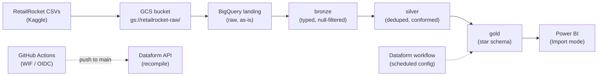

# RetailRocket: A BigQuery Data Warehouse for Real-World e-commerce business data.

An end-to-end, fully serverless data warehouse on **Google Cloud**, built from a public
e-commerce clickstream dataset. Raw CSVs land in Cloud Storage, pass through a
**medallion architecture** (landing → bronze → silver → gold) orchestrated by
**Dataform**, and surface as a **Kimball star schema** in BigQuery — ready for BI.

| | |
|---|---|
| **Cloud** | Google Cloud — BigQuery, Cloud Storage, IAM, Workload Identity Federation |
| **Transformation** | Dataform (SQLX models, dependency graph, assertions) |
| **CI/CD** | GitHub Actions — keyless (OIDC) authentication, auto-recompile on push |
| **BI** | Power BI (Import mode via the native BigQuery connector) |
| **Dataset** | [RetailRocket](https://www.kaggle.com/retailrocket/retailrocket-ecommerce-dataset) — e-commerce events, May–Sep 2015 |
| **Scale** | ~23M rows / ~900 MB raw (2.76M events, 20.3M item-property rows, 1,669 categories) |
| **Cost** | $0 — runs entirely within the BigQuery free tier (1 TiB queries + 10 GiB storage / month) |

## Why this project

This warehouse is a rebuild. The same star-schema design was first implemented on
Azure (Blob → Databricks PySpark → Azure SQL), but the **Azure for Students
subscription expired**, cutting off access to every Azure service — the pipeline
could no longer be managed, let alone completed. The data engineering itself was
sound; the platform underneath it disappeared.

The design was migrated to Google Cloud, where BigQuery is **fully serverless**:
no clusters, no autotermination, no node quotas, no subscription that can lapse on
a student tier. The star schema, grain, and cleansing rules were carried over
unchanged; only the platform-specific code was rewritten (PySpark → Dataform SQLX,
ADF → Dataform workflows, service-account keys → Workload Identity Federation).

## Architecture



| Layer | Dataset | What it does | Built by |
|---|---|---|---|
| Landing | `retailrocket_landing` | Raw CSVs loaded as-is, schema auto-detected | `bq load` from GCS |
| Bronze | `retailrocket_bronze` | Types enforced (epoch-ms → `TIMESTAMP`), null keys removed | Dataform SQLX |
| Silver | `retailrocket_silver` | Deduplicated on business keys; `item_properties` filtered to `categoryid` / `available` | Dataform SQLX |
| Gold | `retailrocket_gold` | Star schema: 5 dimensions + 1 fact table | Dataform SQLX |
| Quality | `retailrocket_dataform_assertions` | Data-quality checks as assertion views | Dataform assertions |

## Data model (gold)

```
                    dim_date (full_date PK)
                          ▲
dim_users ──┐             │
            ├─▶ fact_events (one row per user action)
dim_items ──┤      PARTITION BY event_date
            │      CLUSTER BY user_sk, item_sk
dim_event_type ┘
dim_items ──▶ dim_categories (parent-child hierarchy)
```

- **Grain:** one row per user event (view / addtocart / transaction)
- **Surrogate keys:** `FARM_FINGERPRINT(natural_key)` — deterministic, so re-runs are
  idempotent (no `AUTO_INCREMENT` in BigQuery; and `FARM_FINGERPRINT` is signed, so
  negative keys are expected by design)
- **`dim_date` uses its natural key (`DATE`) as the PK** — Kimball's accepted exception
  to the surrogate-key rule, eliminating a redundant column from the fact table and
  enabling native DATE partitioning
- **Performance:** `fact_events` is partitioned by `event_date` and clustered by
  `user_sk, item_sk` to keep BI queries cheap

## Data quality

Dataform runs assertions automatically after each execution:

| Assertion | Checks |
|---|---|
| `row_counts` | Fact rows = silver events (1:1 grain preserved) |
| `unique_keys` | Primary keys unique across all 6 gold tables |
| `referential_integrity` | No orphan foreign keys in `fact_events` |
| `business_logic` | Event-type set, valid date ranges, transaction-ID rules |

Plus built-in `nonNull` / `uniqueKey` constraints declared inline on every model.

## CI/CD — keyless authentication

Pushes to `main` trigger a GitHub Actions workflow that recompiles the Dataform
release configuration and promotes it to production — using **Workload Identity
Federation (OIDC)**:

- **No stored credentials.** No service-account JSON in GitHub secrets, no PATs.
  Each run authenticates with a short-lived OIDC token that expires with the job.
- **Dev/prod separation:** the `dev` workspace writes to `*_dev` schemas; the
  `main`-branch release configuration writes to production schemas.
- The workflow calls the Dataform API directly (create compilation result → update
  release config), because release configurations don't recompile automatically on
  Git push.

## Repository layout

```
├── .github/workflows/       # Dataform recompile on push (WIF/OIDC)
├── bronze/                  # Ingestion scripts + row-count verification (audit record)
├── dataform/                # Dataform workspace mirror (connected to this repo)
│   └── definitions/
│       ├── sources/         # Landing-layer declarations
│       ├── bronze/          # Typed models
│       ├── silver/          # Deduplicated / conformed models
│       ├── gold/            # Star schema models
│       └── quality/         # Custom data-quality assertions
├── warehouse/schema/        # Exported BigQuery DDL (documentation)
└── workflow_settings.yaml   # Dataform project defaults
```

## Verified data integrity

Landing-layer loads were validated against the Kaggle-documented row counts:

| Table | Rows loaded | Kaggle expected | Result |
|---|---:|---:|:---:|
| `events` | 2,756,101 | 2,756,101 | ✅ |
| `category_tree` | 1,669 | 1,669 | ✅ |
| `item_properties` | 20,275,902 | 20,275,902 | ✅ |

Header-row handling was confirmed two ways: exact row-count match, and `INTEGER`
column types (a stray header row would have forced `STRING`).

## Downstream analytics

The gold layer feeds a Power BI model via the native BigQuery connector in
**Import mode** — chosen deliberately: the dataset is a fixed historical snapshot,
and importing once protects the BigQuery query free tier. A **conversion-funnel
dashboard implementation is currently in the works** (funnel: views → add-to-cart
→ transactions, built on `fact_events` + `dim_event_type`), with customer
segmentation and category/availability analysis planned next.
