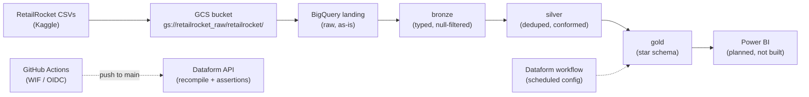
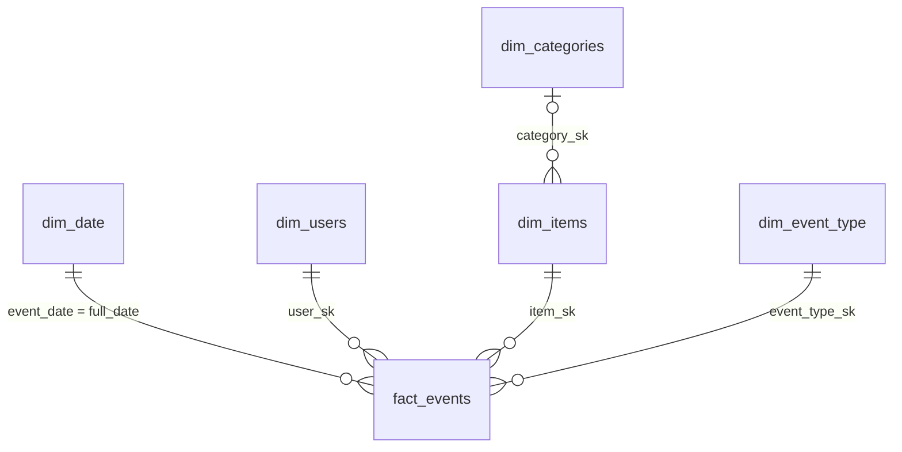

# RetailRocket: A BigQuery Data Warehouse for E-commerce Clickstream Data

A fully serverless data warehouse on **Google Cloud**, built from a public e-commerce dataset that records what visitors viewed, added to cart and bought on one online shop. Raw CSV files land in Cloud Storage, then pass through a **medallion architecture** (landing, bronze, silver, gold: four stages that each clean the data a bit more), built by **Dataform**. They end up as a **Kimball star schema** (one central table of events surrounded by lookup tables) in BigQuery, ready for a BI tool.

**Status:** the warehouse is finished and tested. The Power BI reporting layer is not built yet.

## At a glance

| Item | Details |
|---|---|
| **Cloud** | Google Cloud: BigQuery, Cloud Storage, IAM, Workload Identity Federation |
| **Transformation** | Dataform (SQLX models, dependency graph, assertions) |
| **CI/CD** | GitHub Actions with keyless (OIDC) login, auto-recompile on push |
| **BI** | Power BI via the native BigQuery connector (planned, not built) |
| **Dataset** | [RetailRocket](https://www.kaggle.com/datasets/retailrocket/ecommerce-dataset), May to Sep 2015 |
| **Scale** | ~23M raw rows: 2.76M events, 20.3M item-property rows, 1,669 categories |
| **Cost** | $0, inside the BigQuery free tier (1 TiB queries and 10 GiB storage per month) |

## Why this project

This project serves as a challenge to build an end-to-end data engineering and analytics platform for BI analytics on a modern cloud platform. Instead of just creating a dashboard, this project starts with the engineering of a data warehouse layer to serve a reusable, secure, reproducible, resilient and modern data pipeline for the business intelligence inside of the dashboard downstream. The warehouse uses a star-schema design which was first implemented on Microsoft Azure (Blob → Databricks PySpark → Azure SQL), but the **Azure for Students subscription expired**, cutting off access to every Azure service. Since the pipeline could no longer be managed, the data engineering foundation was migrated to use BigQuery and Dataform.

The design was migrated to Google Cloud, where BigQuery is **fully serverless**. On Azure, managing a cluster proved difficult because of the limited subscription. The star schema, grain, and cleansing rules were carried over unchanged; only the platform-specific code was rewritten (PySpark → Dataform SQLX, ADF → Dataform workflows, service-account keys → Workload Identity Federation).

## Architecture



- The three Kaggle CSVs are uploaded once to a Cloud Storage bucket (`gs://retailrocket_raw/retailrocket/`, note the underscores), then loaded into the landing dataset in BigQuery.
- Dataform builds bronze, silver and gold in order. If a quality check fails, the build stops.
- Work happens on `dev`. When the full build is done, `dev` is merged into `main` through a pull request. That merge starts GitHub Actions, which logs in with no stored key and asks Dataform to recompile, so scheduled runs use the latest schemas.
- The Power BI layer is planned and does not exist yet.

## Tech stack and what each tool does

| Tool | What it does here |
|---|---|
| Google Cloud Storage | Holds the raw CSVs as the first landing zone |
| BigQuery | The warehouse itself. Stores every layer and answers queries. Being serverless is why the project survived losing the Azure subscription |
| Dataform | Writes and runs all transformations as SQLX files, in dependency order. Replaces Databricks and Azure Data Factory from the Azure build (PySpark became SQLX, ADF became Dataform workflows) |
| Dataform assertions | Four quality checks that run after every build. Replace the manual check notebook from the Azure build |
| GitHub Actions with Workload Identity Federation (OIDC) | Recompiles and runs Dataform on every push to `main`. Uses short-lived tokens instead of service-account keys, so no secret is stored in the repo. Replaces the PAT-based workflow of the Azure build |
| `workflow_settings.yaml` | Dataform defaults: project ID, target datasets, core version |
| Power BI (planned) | Would read the gold tables through the BigQuery connector in Import mode. Not built yet |

## The dataset

[RetailRocket](https://www.kaggle.com/datasets/retailrocket/ecommerce-dataset) is an anonymized clickstream log from a real online shop, published by Retail Rocket (a product-recommendation company) for recommender-system research. It records what visitors did, such as which pages they viewed, what they added to cart and what they bought, rather than only completed sales.

All values are hashed for privacy. Only two item properties stay readable: `categoryid` and `available`. Prices, text and brands are hashed by the publisher, so price and product-name analysis is not possible. That is the dataset's design, not a limit of this pipeline.

| File | Rows | Size | What it holds |
|---|---:|---:|---|
| `events.csv` | 2,756,101 | 94 MB | One row per visitor action |
| `item_properties_part1+2.csv` | 20,275,902 | 893 MB | Change log of item attributes over time (the publisher merged repeated values, cutting it about 10 times) |
| `category_tree.csv` | 1,669 | 14 KB | Category hierarchy, child to parent (empty parent = top level) |

- **Period:** May 3 to September 18, 2015 (4.5 months, 139 dates with activity).
- **People and products:** 1,407,580 unique visitors. 417,053 items in the properties file, of which 235,061 appear in events.
- **Event types:** `view` (2,664,312), `addtocart` (69,332), `transaction` (22,457).
- **License:** [CC BY-NC-SA 4.0](https://creativecommons.org/licenses/by-nc-sa/4.0/), as stated on the Kaggle page.

<details>
<summary>Column guide: what each field means and what is odd about it</summary>

| Column | Found in | Meaning | Odd about it |
|---|---|---|---|
| `timestamp` | events, item_properties | When the action or change happened | Unix milliseconds (13 digits), not seconds. Divide by 1000 before converting |
| `visitorid` | events | The visitor, as a pseudonymous ID | No session ID anywhere, so visits cannot be split into browsing sessions |
| `event` | events | What the visitor did | Three values: `view`, `addtocart`, `transaction`. The dataset spells addtocart as one word |
| `itemid` | events, item_properties | The product | 417,053 items in the properties file, 235,061 in events |
| `transactionid` | events | The purchase reference | Filled only on `transaction` rows. All 22,457 non-null values sit on transactions |
| `property` | item_properties | Which attribute changed | 1,104 distinct keys, but only `categoryid` and `available` are readable |
| `value` | item_properties | The attribute value | Mostly hashed numbers. Readable only for category IDs and the 0/1 availability flag |
| `categoryid` | category_tree | A category | The only analysis key in the properties file |
| `parentid` | category_tree | The parent category | Empty means top level |

</details>

## Cleaning and transformation steps

Every count below was recomputed on the full Kaggle CSVs with the same rules the SQL applies, then cross-checked against the production tables. The landing counts also match the Kaggle documentation exactly (2,756,101 events, 1,669 categories, 20,275,902 item-property rows).

**Rows by layer, at a glance**

| Stage | Rows in | Rows out | Main change |
|---|---:|---:|---|
| Landing to bronze | 2,756,101 events | 2,756,101 | Types fixed, no rows lost |
| Bronze to silver (events) | 2,756,101 | 2,755,641 | 460 repeated events removed (0.017%) |
| Bronze to silver (item properties) | 20,275,902 | 2,291,853 | Kept the two readable properties (11.3%) |
| Silver to gold (fact table) | 2,755,641 | 2,755,641 | Joined to 4 lookup tables, no rows lost |

<details>
<summary>Landing to bronze: fix types and filter nulls (2,756,101 events in, 2,756,101 out)</summary>

| Step | What it does and why | Rows before | Rows after |
|---|---|---:|---:|
| Load the CSVs as-is (schema auto-detected, header skipped) | The starting point every later count is measured from | 2,756,101 events | 2,756,101 events |
| Cast `timestamp` to INT64 and create `event_timestamp` with `TIMESTAMP_MILLIS` | Turns 13-digit Unix milliseconds into a real timestamp. Auto-detect can load it as text or a decimal, which silently breaks date logic | 2,756,101 | 2,756,101 |
| Cast `visitorid`, `itemid`, `transactionid` to INT64 | IDs stop being compared as text, which would break joins and sorting | 2,756,101 | 2,756,101 |
| Drop rows with a null `visitorid` or `itemid` (with inline `nonNull` checks) | A row missing either key cannot join any lookup table. 0 rows were removed because the raw file has no null keys, but the rule is documented and enforced | 2,756,101 | 2,756,101 |
| `category_tree`: pass through unchanged | Already clean at the source | 1,669 | 1,669 |
| `item_properties`: cast `timestamp` only | Keeps the full change log here. Filtering is an analysis choice, so it belongs in silver | 20,275,902 | 20,275,902 |

Code: `bronze/load_landing.sh`, `bronze/verify_counts.sql`, `definitions/bronze/*.sqlx`

</details>

<details>
<summary>Bronze to silver: remove repeats, keep what is readable (events 2,756,101 to 2,755,641)</summary>

| Step | What it does and why | Rows before | Rows after |
|---|---|---:|---:|
| Drop rows with a null `timestamp_ms` | An event with no time cannot go on the date table. None were found | 2,756,101 | 2,756,101 |
| Remove repeats on (`timestamp_ms`, `visitorid`, `itemid`, `event`), keeping the row with the larger `transactionid` | The same time, visitor, item and action twice is a logging repeat. This removes 460 rows (0.017%). Keeping the row that carries a `transactionid` is why all 22,457 purchases survive | 2,756,101 | 2,755,641 |
| In `item_properties`, keep only `categoryid` and `available`, then remove repeats on (`itemid`, `property`, `timestamp_ms`) | Every other property is hashed and unreadable. This keeps 11.3% of the rows and turns a 20M-row change log into a table that joins cleanly | 20,275,902 | 2,291,853 |
| `category_tree`: pass through from bronze | Already clean | 1,669 | 1,669 |
| Inline `nonNull` checks on `visitorid`, `itemid`, `timestamp_ms`, `event` | A null in any of these would break the repeat-removal rule, so the build refuses to run | 2,755,641 | 2,755,641 |

Code: `definitions/silver/*.sqlx`

</details>

<details>
<summary>Silver to gold: build the star schema (2,755,641 events in, 5 lookup tables and 1 fact table out)</summary>

| Step | What it does and why | Rows before | Rows after |
|---|---|---:|---:|
| `dim_date`: distinct dates plus calendar columns | Covers exactly the 139 dates with activity. Day, week, month and quarter are worked out once, so reports do not rebuild them | 2,755,641 events | 139 dates |
| `dim_users`: one row per `visitorid`, with first and last event, totals and `has_purchased` | Gives a clean visitor level, ready for repeat-purchase work | 2,755,641 events | 1,407,580 users |
| Surrogate keys from `FARM_FINGERPRINT(...)` | The same natural key always gives the same ID, so re-runs keep the same keys and joins stay valid. The Azure build used `monotonically_increasing_id()`, which makes new keys on every Spark run and quietly breaks joins | n/a | n/a |
| `dim_items`: each item's latest category (newest row wins), built from items seen in events, with a LEFT JOIN | This is SCD Type 1: one row per item, latest value wins, no history kept. 185,246 items (78.8%) get a category. The other 49,815 (21.2%) keep `category_sk = NULL` instead of being dropped, which avoids the orphan-key bug from the Azure build | 235,061 | 235,061 |
| `dim_categories`: category list with `parent_id` | Keeps the hierarchy for drill-down | 1,669 | 1,669 |
| `dim_event_type`: three-row lookup | One shared list of event names: `view`, `addtocart`, `transaction` | 3 | 3 |
| `fact_events`: INNER JOIN to the four lookup tables, partitioned by `event_date`, clustered by `user_sk` and `item_sk` | Every lookup table comes from the same silver table, so no row should be lost. If one is, the `row_counts` check fails the build. Partitioning and clustering mean a typical query reads one day, not all 2.76M rows, which keeps it inside the 1 TiB free tier | 2,755,641 | 2,755,641 |

Code: `definitions/gold/*.sqlx`

</details>

## Data model (gold)



| Table | One row per | Notable columns |
|---|---|---|
| `fact_events` | User action | `transactionid` is filled only for transactions |
| `dim_date` | Calendar date | Year, month, day, day name, `is_weekend`, quarter |
| `dim_users` | Visitor | First and last event, `total_events`, `total_purchases`, `has_purchased` |
| `dim_items` | Item | `category_sk` (NULL when no category), `is_available` |
| `dim_categories` | Category | `category_id`, `parent_id` |
| `dim_event_type` | Event type | `view`, `addtocart`, `transaction` |

- `dim_date` uses the date itself as its key. This is a standard Kimball exception that saves a column and allows native date partitioning.
- Surrogate keys are signed hashes, so negative values are expected.

## Data quality checks

Dataform runs four checks (`definitions/quality/`) after every build. Each one is a view that returns rows only when something is wrong, so an empty result means a pass. A failed check fails the GitHub Actions build. Inline `nonNull` and `uniqueKey` rules also stop any model with a null key from building.

| Check | What it tests | Mistake it prevents |
|---|---|---|
| `row_counts` | Fact rows equal silver event rows | A join that silently drops or multiplies rows |
| `unique_keys` | `COUNT(*)` equals `COUNT(DISTINCT key)` on all 6 gold tables | Duplicate keys, which would double-count in a BI tool |
| `referential_integrity` | Every fact row matches all 4 lookup tables | Blank labels and broken relationships in reports |
| `business_logic` | Exactly 3 event types, no future dates, dates start in 2015, no negative item IDs, no `transactionid` on non-purchase rows | A view event being counted as a purchase |

## Limits and how to count safely

**What this data cannot tell you**

- No prices or product names (hashed).
- No sessions, because there is no session ID.
- One shop and one 4.5-month window in 2015.
- No returns or cancellations, so a `transaction` row is treated as a finished purchase.
- Heavy visitors skew averages. The publisher warns that logs like this can hold "up to 40% abnormal traffic". Here the median visitor has 1 event and the 99th percentile is 13, but the busiest visitor logged 7,757. The 30 visitors with over 1,000 events make up 2.2% of all events, so filter them before any per-visitor average.

**How to count things**

- **Action:** one row in `fact_events`. That is 2,755,641 rows after repeats are removed, not the raw 2,756,101.
- **Visitor:** a distinct `visitorid` (1,407,580), one row each in `dim_users`. Do not add up a per-event field.
- **Item:** a distinct `itemid`. Only the 235,061 items seen in events are in `dim_items`, by design.
- **Purchase:** an event with `event = 'transaction'` (22,457), each with a `transactionid`.
- **Avoid double counting:** join the fact table to the lookup tables, never to the item-properties change log, which turns one event into many rows.

<details>
<summary>CI/CD with keyless login</summary>

Pushes to `main` start a GitHub Actions workflow that recompiles the Dataform release configuration and promotes it to production. It logs in with **Workload Identity Federation (OIDC)**:

- **No stored credentials.** No service-account JSON in GitHub secrets and no personal access tokens. Each run gets a short-lived token that expires with the job.
- **Dev and prod are separate.** The `dev` workspace writes to `*_dev` schemas. The `main` release configuration writes to production schemas.
- The workflow calls the Dataform API directly (create a compilation result, then update the release config), because release configurations do not recompile on their own after a Git push.

</details>

<details>
<summary>Repository structure</summary>

```text
retailrocket-bigquery-warehouse/
├── README.md
├── workflow_settings.yaml          # Dataform: project, datasets, core version
├── .github/workflows/
│   └── dataform-recompile.yml      # CI: recompile + assertions via OIDC (keyless)
├── dataform/
│   └── dataform.json
├── bronze/                         # Record of the initial load
│   ├── load_landing.sh             #   bq load script (reproduces the console load)
│   ├── verify_counts.sql           #   landing counts vs Kaggle documentation
│   └── README.md                   #   job IDs, notes, gotchas
├── definitions/
│   ├── sources/                    # 3 source declarations
│   ├── bronze/                     # 3 typed raw models
│   ├── silver/                     # 3 cleaned, de-duplicated models
│   ├── gold/                       # 6 star-schema models
│   └── quality/                    # 4 assertion checks
└── warehouse/schema/               # BigQuery DDL exported from the console
    ├── landing.sql  bronze.sql  silver.sql  gold.sql
    └── dataform_assertions.sql
```

19 model and check files in total: 3 source declarations, 3 bronze, 3 silver, 6 gold and 4 assertions.

</details>
